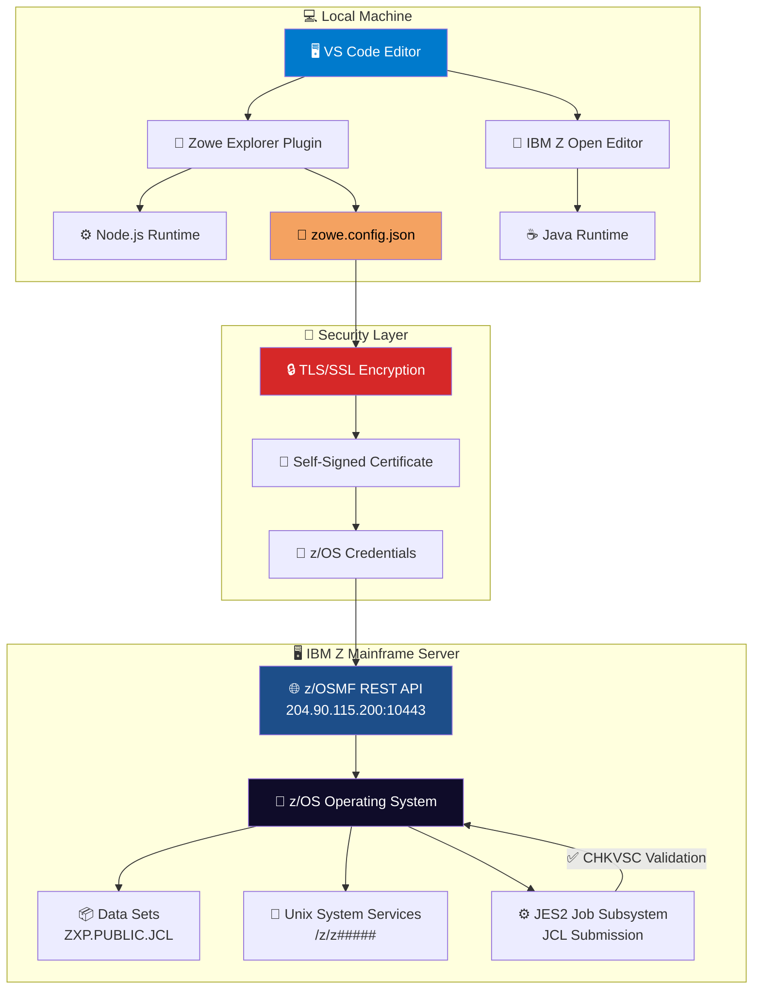
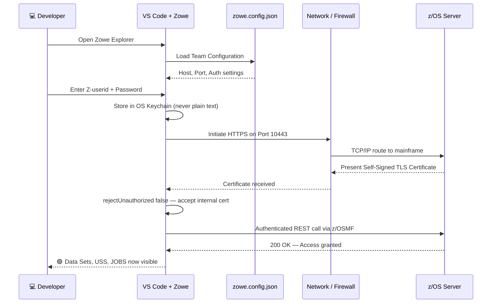
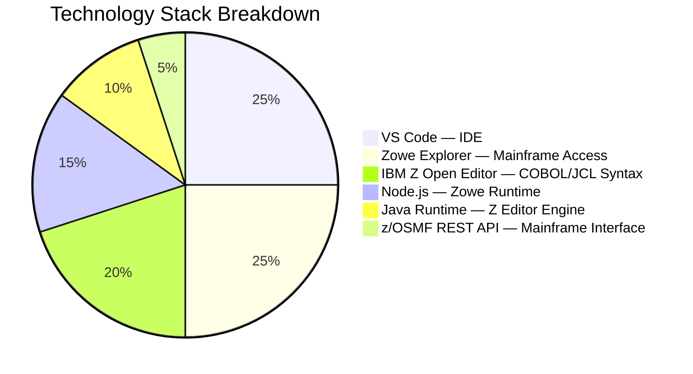
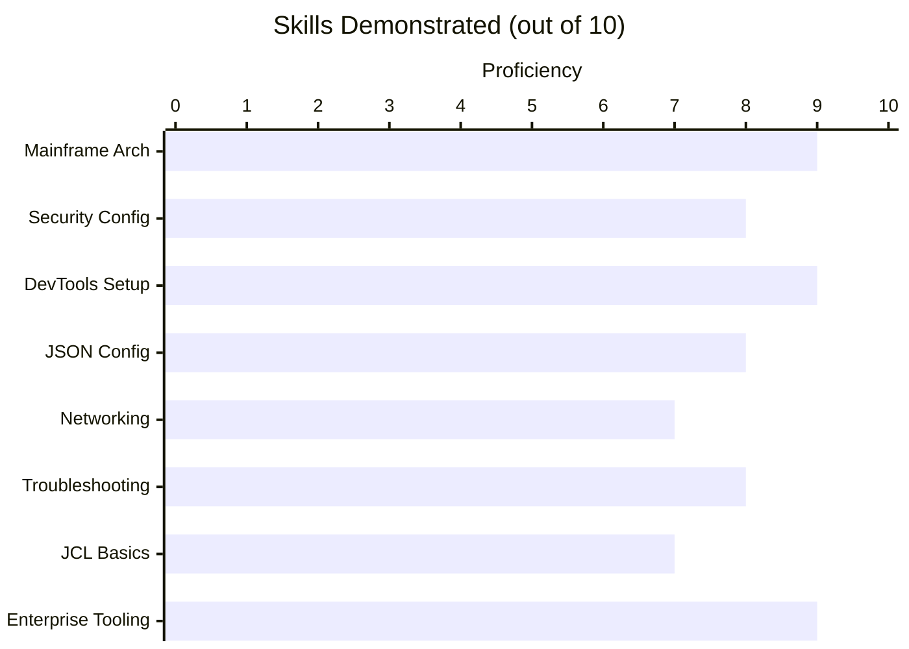
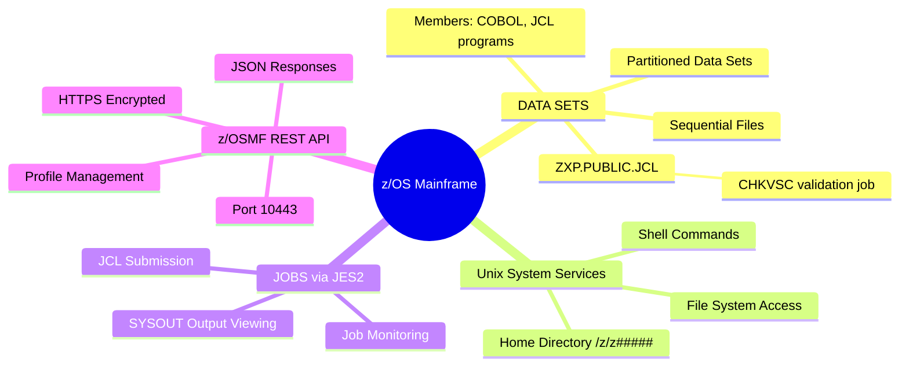
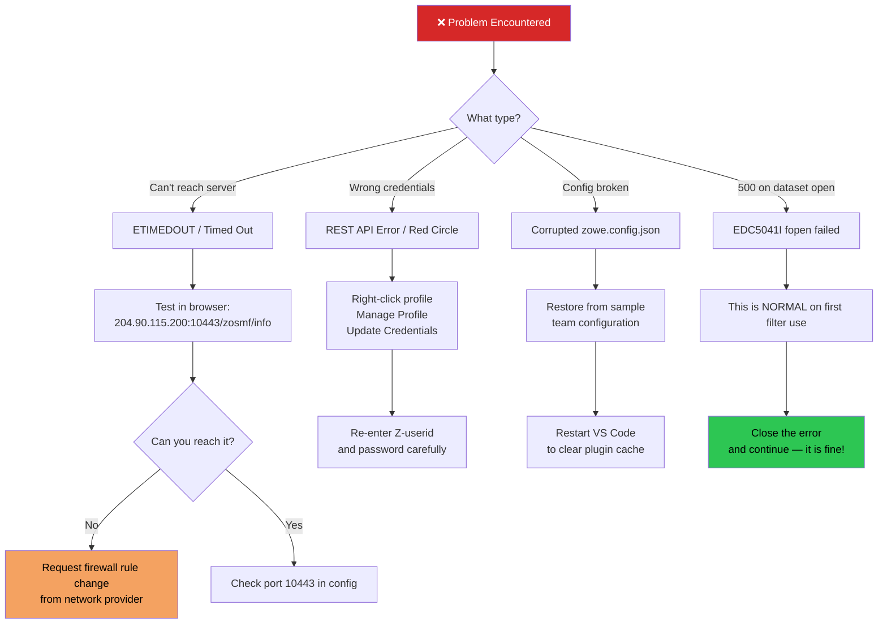

<!-- Animated Header Banner -->
<div align="center">


<!-- Badges Row 1 -->
[](https://ibmzxplore.influitive.com)
[](https://code.visualstudio.com)
[](#)
[](#)

<!-- Badges Row 2 -->
[](https://nodejs.org)
[](https://code.visualstudio.com)
[](https://www.zowe.org)
[](https://developer.ibm.com/languages/java/)
[](#)

</div>

---

## 🚀 What Is This Project?

> **In plain English:** This project documents how I successfully configured a **professional IBM Mainframe development environment** from scratch — the same kind of setup used by engineers at major banks, airlines, and insurance companies that run the world's most critical financial systems.

IBM Z mainframes process **over $8 trillion in daily commercial transactions worldwide**. This challenge (VSC1) is the foundational gateway to that world — proving I can set up, secure, and operate a live connection to a real z/OS mainframe server using modern developer tooling.

**Completing this is not just clicking "Next, Next, Finish."** It requires understanding network security, TLS/SSL certificate trust chains, JSON configuration, mainframe data set architecture, and JCL job submission — all at once.

---

## 🎯 Why This Matters to Your Team

| 💡 Skill Demonstrated | 🏦 Real-World Application |
|---|---|
| Mainframe z/OS connectivity | Banks, insurers, and gov't systems run on z/OS |
| Zowe Explorer configuration | Industry-standard modern Z access tool |
| SSL/TLS self-signed cert handling | Required in enterprise private cloud environments |
| JCL job submission | Core skill for every mainframe operation |
| JSON-based profile management | Modern DevOps config-as-code practices |
| Multi-platform setup (Win/Mac/Linux) | Cross-environment engineering capability |
| Network firewall/connectivity troubleshooting | Critical for enterprise deployments |

---

## 🏗️ System Architecture

Here is a visual map of exactly how my local machine communicates with the IBM Z mainframe:



---

## 🔄 Setup Flow — Step by Step

This flowchart shows the exact sequence from zero to a live mainframe connection:

```mermaid
flowchart LR
    A([🟢 Start]) --> B["Download
Node.js LTS"]
    B --> C["Download
Java Runtime"]
    C --> D["Install
VS Code"]
    D --> E["Install IBM
Z Open Editor
Extension"]
    E --> F["Zowe Explorer
Auto-Installed"]
    F --> G["Create Team
Config File
zowe.config.json"]
    G --> H["Set zosmf
Port: 10443"]
    H --> I["Set tso
Account: FB3"]
    I --> J["Set Host IP
204.90.115.200"]
    J --> K["Disable
rejectUnauthorized"]
    K --> L["Add Z-Userid
& Password"]
    L --> M["Set DATA SETS
Filter"]
    M --> N["Set USS
Filter"]
    N --> O["Set JOBS
Filter"]
    O --> P["Navigate to
ZXP.PUBLIC.JCL"]
    P --> Q["Submit
CHKVSC Job"]
    Q --> R(["🏆 VSC1
Complete!"])

    style A fill:#2dc653,color:#000
    style R fill:#2dc653,color:#000
    style G fill:#f4a261,color:#000
    style K fill:#d62828,color:#fff
    style Q fill:#1d4e89,color:#fff
```



---

## 🔒 Security Architecture Deep Dive

This was not a simple username/password login. Here is the full security handshake:



### 🛡️ Security Features Breakdown

| Security Feature | Implementation | Purpose |
|---|---|---|
| **TLS/SSL Encryption** | HTTPS on port 10443 | All data in transit is encrypted end-to-end |
| **Self-Signed Cert Handling** | `rejectUnauthorized: false` | Allows enterprise internal certs not from a public CA |
| **OS Credential Store** | macOS Keychain / Windows Credential Manager | Passwords never stored in plain text on disk |
| **z/OSMF REST API Auth** | HTTP Basic Auth over TLS | Industry-standard mainframe API authentication |
| **Team Configuration File** | `zowe.config.json` scoped profiles | Separates connection config from secrets |
| **Profile Scoping** | Global vs Project config | Prevents credential leakage across projects |
| **Password Rotation Policy** | 60-day expiry enforced by z/OS | Regular credential hygiene baked into the platform |
| **Firewall Pre-validation** | Browser test before tool setup | Confirms network path before any config work |

> 🔑 **Key Insight:** The self-signed cert pattern mirrors exactly what you encounter in private banking and government cloud environments, where internal Certificate Authorities (CAs) are used instead of public ones like Let's Encrypt.

---

## 🛠️ Full Technology Stack



| Layer | Technology | Version | Role |
|---|---|---|---|
| **IDE** | Visual Studio Code | Latest Stable | Primary development environment |
| **Mainframe Extension** | IBM Z Open Editor | Latest | COBOL, JCL, PL/I syntax support |
| **Mainframe Access** | Zowe Explorer | Bundled | Browse Data Sets, USS, Jobs |
| **Runtime (Zowe)** | Node.js | LTS (20.x+) | Powers Zowe Explorer's UI layer |
| **Runtime (Z Editor)** | Java | LTS (IBM Semeru) | Powers language server for Z files |
| **API Protocol** | z/OSMF REST API | z/OS native | RESTful access to mainframe resources |
| **Config Format** | JSON (zowe.config.json) | Team Config v2 | Profile and connection management |
| **Transport Security** | TLS/HTTPS | Port 10443 | Encrypted communication channel |
| **OS Support** | Windows / macOS / Linux | All platforms | Cross-platform toolchain |

---

## 📊 Skills Applied — At a Glance



---

## ⚡ Quick Start

### Prerequisites Checklist

```
✅ Network access to 204.90.115.200:10443  — test in browser first!
✅ IBM Z Xplore account with assigned Z-userid (e.g., Z12345)
✅ ~45 minutes of setup time
✅ Admin rights on your local machine
```

### Installation Timeline

```mermaid
gantt
    title VSC1 Setup Timeline — 45 Minutes
    dateFormat HH:mm
    axisFormat %M min

    section Downloads
    Download Node.js LTS         :done, 00:00, 5m
    Download Java Runtime        :done, 00:02, 5m
    Download VS Code             :done, 00:04, 5m

    section Installations
    Install Node.js              :done, 00:07, 5m
    Install Java                 :done, 00:09, 4m
    Install VS Code              :done, 00:11, 4m
    Install IBM Z Open Editor    :done, 00:14, 6m

    section Configuration
    Create zowe.config.json      :active, 00:20, 5m
    Configure zosmf and tso      :active, 00:23, 5m
    Set host and cert settings   :active, 00:26, 4m
    Add Z credentials            :active, 00:29, 3m

    section Validation
    Set DATA SETS filter         :crit, 00:32, 3m
    Set USS and JOBS filters     :crit, 00:34, 3m
    Navigate to ZXP.PUBLIC.JCL   :crit, 00:37, 3m
    Submit CHKVSC job            :crit, 00:40, 5m
```



---

## 🧩 What I Connected To — The z/OS Ecosystem



---

## 🔧 Troubleshooting Guide



---

## 🧠 Key Concepts — Plain English Glossary

| Term | What It Actually Means |
|---|---|
| **z/OS** | IBM's operating system for mainframe hardware — like Windows, but for supercomputers that process millions of bank transactions per second |
| **Zowe Explorer** | A VS Code plugin that lets modern developers browse mainframe files and submit jobs — like File Explorer, but for a computer in a data center |
| **z/OSMF** | The mainframe's REST API — it's the mainframe's "web server" that lets modern tools talk to it over standard HTTPS |
| **Data Sets** | The mainframe equivalent of files and folders, but with specific naming rules and fixed-length record structures |
| **JCL** | Job Control Language — instructions that tell the mainframe what program to run, with what data, and how to handle the output. Like a shell script, but for z/OS |
| **CHKVSC** | The specific JCL validation job I submitted to prove my connection was working correctly |
| **TSO Account** | Your billing/resource account on the mainframe (set to `FB3` for IBM Z Xplore) — like a project billing code in cloud computing |
| **Team Configuration** | A JSON file storing connection settings for your team — modern config-as-code applied to mainframe connectivity |
| **rejectUnauthorized: false** | Tells the connection layer to trust an internal certificate not issued by a public authority — required in private enterprise environments |
| **USS** | Unix System Services — a full UNIX file system running inside z/OS. Yes, the mainframe runs UNIX-style commands too |

---

## 📁 Project Structure

```
📦 ibm-z-vscode-mainframe-setup/
├── 📄 README.md                  ← You are here
├── 📄 zowe.config.json           ← Team configuration (sanitized, no credentials)
├── 📁 docs/
│   ├── 📄 architecture.md        ← Detailed architecture notes
│   ├── 📄 security-notes.md      ← SSL/cert configuration rationale
│   └── 📄 troubleshooting.md     ← Common issues and fixes
├── 📁 jcl/
│   └── 📄 CHKVSC.jcl             ← Validation JCL reference copy
└── 📁 screenshots/
    ├── 🖼️ zowe-connected.png      ← Live connection screenshot
    ├── 🖼️ datasets-view.png       ← Data sets browser view
    └── 🖼️ job-complete.png        ← VSC1 challenge completion proof
```

---

## 🔑 zowe.config.json Reference

```json
{
  "profiles": {
    "zosmf": {
      "type": "zosmf",
      "properties": {
        "port": 10443
      }
    },
    "tso": {
      "type": "tso",
      "properties": {
        "account": "FB3"
      }
    },
    "base": {
      "type": "base",
      "properties": {
        "host": "204.90.115.200",
        "rejectUnauthorized": false
      },
      "secure": ["user", "password"]
    }
  }
}
```

> ⚠️ **Security Note:** `rejectUnauthorized: false` is intentional — the z/OS server uses a **self-signed certificate**, common in private enterprise environments. In public production, you would use a CA-verified certificate with this set to `true`.

---

## 🌐 Resources & References

| Resource | Link |
|---|---|
| IBM Z Xplore Platform | [ibmzxplore.influitive.com](https://ibmzxplore.influitive.com) |
| Zowe Explorer Docs | [docs.zowe.org](https://docs.zowe.org) |
| IBM Z Open Editor | [VS Code Marketplace](https://marketplace.visualstudio.com/items?itemName=IBM.zopeneditor) |
| IBM Semeru Java Runtime | [developer.ibm.com](https://developer.ibm.com/languages/java/semeru-runtimes/downloads/) |
| Node.js LTS | [nodejs.org](https://nodejs.org/en/) |
| VS Code Download | [code.visualstudio.com](https://code.visualstudio.com/download) |

---

## 👨‍💻 About the Developer

<div align="center">

**Built and documented by Anand Sundar** — a Senior Full-Stack Engineer with 9+ years of experience in high-throughput payment infrastructure, distributed systems, and backend architecture.

This IBM Z Xplore challenge is part of an active journey into **mainframe engineering and cloud solutions architecture** — bridging modern distributed systems knowledge with the enterprise mainframe platforms that power the world's financial backbone.

[](https://linkedin.com/in/anandsundar96)
[](https://github.com/anandsundar)

</div>

---

<div align="center">


**⭐ If this helped you connect to IBM Z — give it a star!**

*IBM Z Xplore © IBM 2021–2025 | Challenge VSC1 | 250826-0742*

</div>
